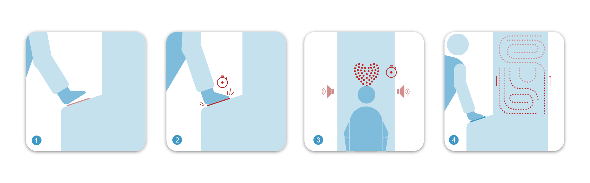

# Heart rate

 

- [Introduction](#introduction)
- [Development](#development)
- [Project additional info](#infos)

## Introduction
*Heart rate* is based on **Arduino sketches**. It reads the signal of a heart sensor. When the sensor detects the heartbeat (it takes up to 5” to read the pulse) the app plays an audio file of a heartbeat and lights up an array of LEDs, rhythmically and consistently with user's heartbeat.
Additionally, it turns on a *one by one animation* of an array of LEDs strips displayed in a folded shape (mimicking veins and arteries). 

### How it works
1. User places their hands on the sensor 
2. The sensor reads the heartbeat
3. The application generates the output: turning on rhythmically the LEDs and generating audio
4. The application starts the LEDs strips animation

## Development
This repository contains the Arduino sketches to perform a heart sensor reading, and generate a visual and sound output.

It requires:

- 1x Arduino UNO
- 1x Arduino MEGA

Upload `HeartBeat_to_digital_out.ino` to the Arduino UNO  
Upload `MDBR_heartrate.ino` to the Arduino MEGA

## Project additional info

### Project purpose
*Heart rate* is designed as an installation. It consists in a totem that features an area where the users place their hands and a set of LEDs and LED stripes. The hands area allows the heart sensor to check user heartbeat. Three types of LEDs are displayed
- LEDs arranged in the shape of a heart
- folded led stripes representing vein circulation
- folded led stripes representing arterial circulation

*Heart rate* has been part of a thematic exposition of installation about human body and its apparatuses where kids can play with simulation of parts of human body to learn information and to experiment with their own body.

